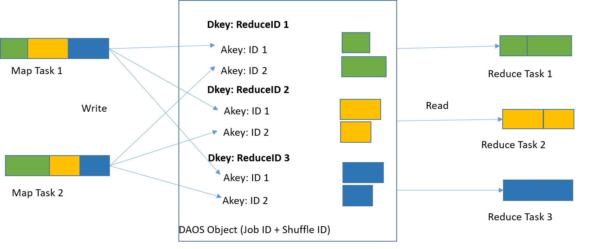

##### \* LEGAL NOTICE: Your use of this software and any required dependent software (the "Software Package") is subject to the terms and conditions of the software license agreements for the Software Package, which may also include notices, disclaimers, or license terms for third party or open source software included in or with the Software Package, and your use indicates your acceptance of all such terms. Please refer to the "TPP.txt" or other similarly-named text file included with the Software Package for additional details.

##### \* Optimized Analytics Package for Spark* Platform is under Apache 2.0 (https://www.apache.org/licenses/LICENSE-2.0).

# Remote Shuffle Plugins

## Online Documentation

You can find the all the Remote Shuffle documents on the [project web page](https://oap-project.github.io/remote-shuffle/).

## Introduction
Remote Shuffle is a Spark* ShuffleManager plugin, shuffling data through a remote datastore, as opposed to vanilla Spark's local-disks.

This is an essential part of enabling Spark on disaggregated compute and storage architecture.

There are two shuffle plugins in this project.
- shuffle-hadoop, A remote shuffle plugin based Hadoop filesystem.
    This plugin can work with any remote filesystems compatible with Hadoop, like HDFS, AWS S3 and [DAOS](https://github.com/daos-stack/daos).
- shuffle-daos
    Different from the above general plugin based on Hadoop Filesystem interface, this plugin bases on DAOS Object API.
    Thanks to DAOS Distribution Key and Attribute Key, we can improve performance by constructing shuffle output like
    below.
    


## Developer Guide
### Build and Deploy

We have provided a Conda package which will automatically install dependencies needed by OAP, you can refer to [OAP-Installation-Guide](./docs/OAP-Installation-Guide.md) for more information. If you have finished [OAP-Installation-Guide](./docs/OAP-Installation-Guide.md), you can find compiled remote shuffle jars under `$HOME/miniconda2/envs/oapenv/oap_jars`.
Then just skip this section and jump to [User Guide](#g1).

Build using the following command in `remote-shuffle` folder. This file needs to be deployed on every compute node that runs Spark. Manually place it on all nodes or let resource manager do the work.

```
    mvn -DskipTests clean package 
```
## <a name="g1"></a>User Guide (shuffle-hadoop)
### Enable Remote Shuffle

Add the `.jar` files to the classpath of Spark driver and executors: Put the
following configurations in spark-defaults.conf or Spark submit command line arguments. 

Note: For DAOS users, DAOS Hadoop/Java API jars should also be included in the classpath as we leverage DAOS Hadoop filesystem.
    
```
    spark.executor.extraClassPath          $HOME/miniconda2/envs/oapenv/oap_jars/remote-shuffle-<version>.jar
    spark.driver.extraClassPath            $HOME/miniconda2/envs/oapenv/oap_jars/remote-shuffle-<version>.jar
```

Enable the remote shuffle manager and specify the Hadoop storage system URI holding shuffle data.

```
    spark.shuffle.manager                      org.apache.spark.shuffle.remote.RemoteShuffleManager
    spark.shuffle.remote.storageMasterUri      daos://default:1 # Or hdfs://namenode:port, file:///my/shuffle/dir
```

### Configurations

Configurations and tuning parameters that change the behavior of remote shuffle. Most of them should work well under default values.

#### Shuffle Root Directory

This is to configure the root directory holding remote shuffle files. For each Spark application, a
directory named after application ID is created under this root directory.

```
    spark.shuffle.remote.filesRootDirectory     /shuffle
```

#### Index Cache Size

This is to configure the cache size for shuffle index files per executor. Shuffle data includes data files and
index files. An index file is small but will be read many (the number of reducers) times. On a large scale, constantly
reading these small index files from Hadoop Filesystem implementation(i.e. HDFS) is going to cause much overhead and latency. In addition, the shuffle files’
transfer completely relies on the network between compute nodes and storage nodes. But the network inside compute nodes are
not fully utilized. The index cache can eliminate the overhead of reading index files from storage cluster multiple times. By
enabling index file cache, a reduce task fetches them from the remote executors who write them instead of reading from
storage. If the remote executor doesn’t have a desired index file in its cache, it will read the file from storage and cache
it locally. The feature can also be disabled by setting the value to zero.

```
    spark.shuffle.remote.index.cache.size        30m
```

#### Number of Threads Reading Data Files

This is one of the parameters influencing shuffle read performance. It is to determine number of threads per executor reading shuffle data files from storage.

```
    spark.shuffle.remote.numReadThreads           5
```

#### Number of Threads Transitioning Index Files (when index cache is enabled)

This is one of the parameters influencing shuffle read performance. It is to determine the number of client and server threads that transmit index information from another executor’s cache. It is only valid when the index cache feature is enabled.

```
    spark.shuffle.remote.numIndexReadThreads      3
```

#### Bypass-merge-sort Threshold

This threshold is used to decide using bypass-merge(hash-based) shuffle or not. By default we disable(by setting it to -1) 
hash-based shuffle writer in remote shuffle, because when memory is relatively sufficient, sort-based shuffle writer is often more efficient than the hash-based one.
Hash-based shuffle writer entails a merging process, performing 3x I/Os than total shuffle size: 1 time for read I/Os and 2 times for write I/Os, this can be an even larger overhead under remote shuffle:
the 3x shuffle size is gone through network, arriving at a remote storage system.

```
    spark.shuffle.remote.bypassMergeThreshold     -1
```

#### Configurations fetching port for HDFS

When the backend storage is HDFS, we contact http://$host:$port/conf to fetch configurations. They were not locally loaded because we assume absence of local storage.

```
    spark.shuffle.remote.hdfs.storageMasterUIPort  50070
```

#### Inherited Spark Shuffle Configurations

These configurations are inherited from upstream Spark, they are still supported in remote shuffle. More explanations can be found in [Spark core docs](https://spark.apache.org/docs/3.0.0/configuration.html#shuffle-behavior) and [Spark SQL docs](https://spark.apache.org/docs/2.4.4/sql-performance-tuning.html).
```
    spark.reducer.maxSizeInFlight
    spark.reducer.maxReqsInFlight
    spark.reducer.maxBlocksInFlightPerAddress
    spark.shuffle.compress
    spark.shuffle.file.buffer
    spark.shuffle.io.maxRetries
    spark.shuffle.io.numConnectionsPerPeer
    spark.shuffle.io.preferDirectBufs
    spark.shuffle.io.retryWait
    spark.shuffle.io.backLog
    spark.shuffle.spill.compress
    spark.shuffle.accurateBlockThreshold
    spark.sql.shuffle.partitions
```

#### Deprecated Spark Shuffle Configurations

These configurations are deprecated and will not take effect.
```
    spark.shuffle.sort.bypassMergeThreshold        # Replaced by spark.shuffle.remote.bypassMergeThreshold 
    spark.maxRemoteBlockSizeFetchToMem             # As we assume no local disks on compute nodes, shuffle blocks are all fetched to memory

    spark.shuffle.service.enabled                  # All following configurations are related to External Shuffle Service. ESS & remote shuffle cannot be enabled at the same time, as this remote shuffle facility takes over almost all functionalities of ESS.
    spark.shuffle.service.port
    spark.shuffle.service.index.cache.size
    spark.shuffle.maxChunksBeingTransferred
    spark.shuffle.registration.timeout
    spark.shuffle.registration.maxAttempts
```

### Performance Evaluation Tool

Leverage this tool to evaluate shuffle write/read performance separately under your specific storage system. This tool starts one Java process with #poolSize number of threads, running the specified remote-shuffle writers/readers in this module. Additional Spark configurations can be put in "./spark-defaults.conf" and will be loaded.(and printed as part of the summary for recording)

Configuration details:
* `-h` or `--help`: display help messages
* `-m` or `--mappers`: the number of mappers, default to 5
* `-r` or `--reducers`: the number of reducers, default to 5
* `-p` or `--poolSize`: the number task threads in write/read thread pool, similar to spark.executor.cores. e.g. if mappers=15, poolSize=5, it takes 3 rounds to finish this job
* `-n` or `--rows`: the number of rows per mapper, default to 1000
* `-b` or `--shuffleBlockRawSize`: the size of each shuffle block, default to 20000 Bytes
* `-w` or `--writer`: the type of shuffle writers for benchmark, can be one of general, unsafe and bypassmergesort, default to unsafe
* `-onlyWrite` or `--onlyWrite`: containing this flag then the benchmark only includes shuffle write stage, default behavior is perform both write & read
* `-uri` or `--storageMasterUri`: Hadoop-compatible storage Master URI, default to file://
* `-d` or `--dir`: Shuffle directory, default /tmp
* `-l` or `--log`: Log level, default to WARN


Sample command:
```
java -cp target/remote-shuffle-0.1-SNAPSHOT-test-jar-with-dependencies.jar org.apache.spark.shuffle.remote.PerformanceEvaluationTool -h
```

Sample output
```
unsafe shuffle writer:
    raw total size:      123 GB
    compressed size:     135 GB
    duration:            88.3 seconds

    throughput(raw):     1429.06843144412 MB/s
    throughput(storage): 1570.9931870053674 MB/s

    number of mappers:   210
    number of reducers:  70
    block size(raw):     8 MB
    block size(storage): 9 MB

    properties:          spark.reducer.maxSizeInFlight -> 100m, spark.shuffle.remote.numReadThreads -> 8, spark.shuffle.remote.reducer.maxBlocksInFlightPerAddress -> 3

    records per mapper:  70
    load size per record:9000000

    shuffle storage      daos://default:1
    shuffle folder:      /tmp/shuffle
-------------------------------------------------------------------------------------------------------------------------
shuffle reader:
    raw total size:      123 GB
    compressed size:     135 GB
    duration:            49.8 seconds

    throughput(raw):     2533.665772753123 MB/s
    throughput(storage): 2785.2911586057153 MB/s

    number of mappers:   210
    number of reducers:  70
    block size(raw):     8 MB
    block size(storage): 9 MB

    properties:          spark.reducer.maxSizeInFlight -> 100m, spark.shuffle.remote.numReadThreads -> 8, spark.shuffle.remote.reducer.maxBlocksInFlightPerAddress -> 3

    records per mapper:  70
    load size per record:9000000

    shuffle storage      daos://default:1
    shuffle folder:      /tmp/shuffle                                                      
```

## User Guide (shuffle-daos)

Most of [User Guide (shuffle-hadoop)](#g1) can be applied to shuffle-daos. We'll not repeat them here. Just show
differences here.

### Shuffle Manager

```
    spark.shuffle.manager                      org.apache.spark.shuffle.daos.DaosShuffleManager
```

### Classpath
    
```
    spark.executor.extraClassPath          $HOME/miniconda2/envs/oapenv/oap_jars/daos-java-<version>.jar
        $HOME/miniconda2/envs/oapenv/oap_jars/hadoop-daos-<version>.jar
        $HOME/miniconda2/envs/oapenv/oap_jars/shuffle-daos-<version>.jar
    spark.driver.extraClassPath            $HOME/miniconda2/envs/oapenv/oap_jars/daos-java-<version>.jar
        $HOME/miniconda2/envs/oapenv/oap_jars/hadoop-daos-<version>.jar
        $HOME/miniconda2/envs/oapenv/oap_jars/shuffle-daos-<version>.jar
```